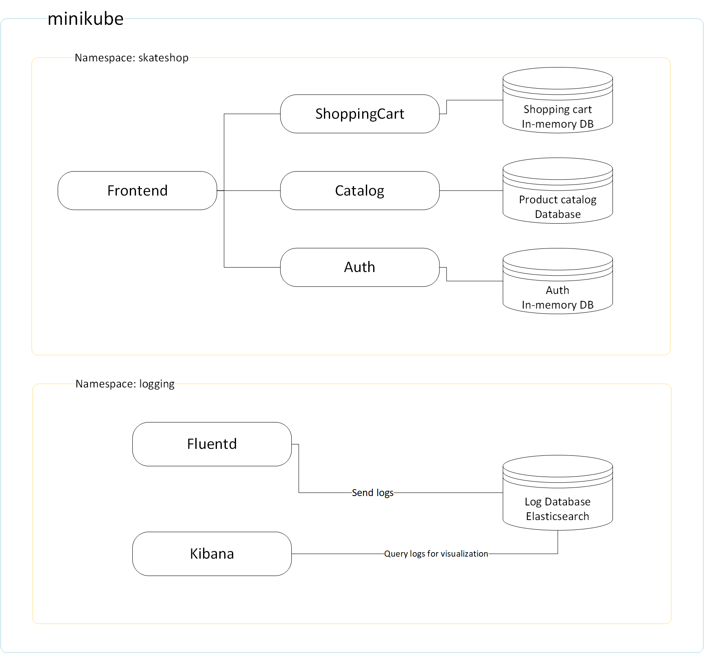

# skateboard-shop

Demo application made by leveraging the `microservices` arhitecture style.


```
minikube start --cpus 4 --memory 6144
```

# Microservices

* Frontend - UI component of the application
* Catalog - contains products with stock info
* ShoppingCart - contains items added in cart and processes payments
* Tracking - track orders

